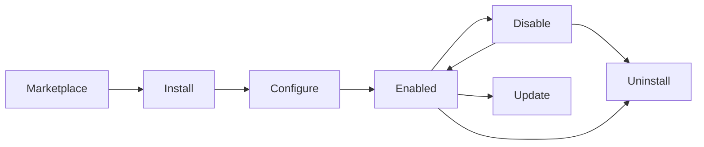
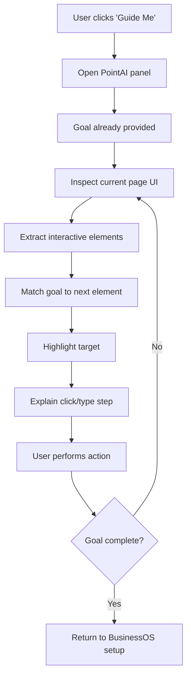
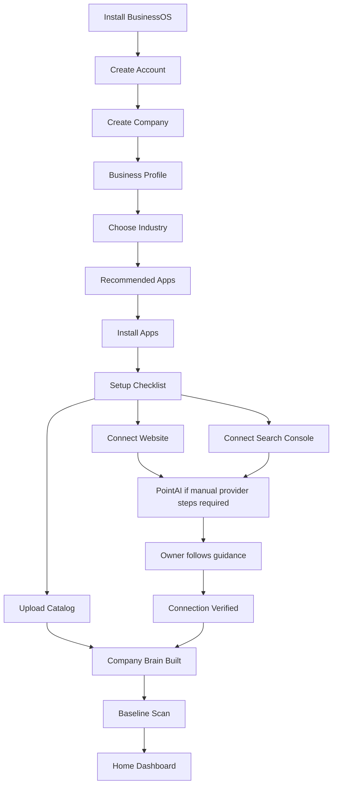

# BusinessOS / GrowthOS — Unified Architecture, Plugin Platform, PointAI, and Frontend Build Specification

**Status: active build plan for the product/frontend layer.**

Paired with `docs/superpowers/specs/2026-09-09-unified-platform-design.md`, which remains the
authority on safety boundaries, the PointAI port, and provider routing. That spec carries a
"Reconciliation" section recording where the two documents disagreed and which one won on
each point. Read it before treating anything here as settled.

Unresolved disagreements are listed there, not here. Where this document is silent on a
safety boundary, the spec applies.

---

# BusinessOS / GrowthOS — Unified Product, Architecture, Plugin Platform, PointAI, and Frontend Build Specification

> **Purpose:** This is the implementation source of truth for an engineering agent building the next version of BusinessOS / GrowthOS.
>
> The product must remain usable by a non-technical small-business owner. The architecture must keep the core stable, move business capabilities into installable plugins, and use PointAI to guide users through third-party setup steps that the system should not perform on their behalf.

---

# 0. Product in One Sentence

**BusinessOS is a local-first AI operating system for small businesses that learns how a company works, performs recurring growth and operating work through installable plugins, asks for approval when needed, and uses PointAI to guide non-technical owners through setup steps inside third-party products without clicking or typing for them.**

The first production business is **ABizCreator**, a printing/design business in Jaipur, but nothing in the core should be hardcoded to ABizCreator.

---

# 1. Product Principles

## 1.1 Core First, Plugins Second

The system is divided into two layers:

```text
BUSINESSOS CORE
+
INSTALLABLE BUSINESS PLUGINS
```

The core is always present.

Plugins are optional capabilities installed from the GrowthOS Marketplace.

A business should be able to start with only the core and later add:

```text
SEO
Google Business
CRM
Pricing
Quotations
Projects
Content
Campaigns
Analytics
Email
WhatsApp
Website
etc.
```

The operating system must not be rebuilt when a new capability is added.

---

## 1.2 Plugins Should Feel Like Apps

The owner-facing terminology should be:

```text
Apps & Features
Marketplace
Installed
Enable
Disable
Uninstall
```

Avoid exposing:

```text
manifest
runtime
GitHub repo
MCP
dependency graph
package
repository
```

to normal small-business users.

Those remain developer concepts.

---

## 1.3 GitHub Plugin Creator Is a Developer Tool, Not an Owner Feature

The current GitHub repository/plugin importer should **not appear in the normal business-owner Marketplace**.

A non-technical owner should not be expected to:

- search GitHub;
- understand repositories;
- decide whether code is safe;
- know what an MCP server is;
- choose package runtimes;
- inspect manifests.

Instead:

```text
DEVELOPER SIDE
GitHub / local project / plugin creator
↓
BusinessOS plugin packaging
↓
Validation + sandbox
↓
Signed/published plugin
↓
GrowthOS Marketplace
↓
Business owner installs it
```

The GitHub importer/repository analyzer remains useful internally for developers and plugin authors.

---

## 1.4 Integrations Must Never Be the Product's Usability Bottleneck

The target customer does not understand:

```text
OAuth
API keys
redirect URIs
DNS records
application passwords
Google Cloud Console
WordPress capabilities
```

BusinessOS should therefore use **PointAI** for guided setup.

PointAI:

- points to the correct UI element;
- explains what to click;
- tells the user what to type when appropriate;
- shows the next step;
- can maintain a short multi-step playbook;
- never clicks;
- never types;
- never submits;
- never sees or stores passwords/credentials.

This is a permanent product boundary.

---

## 1.5 Human Crosses Credential and Production Boundaries

Architecture rule:

```text
Inside third-party authenticated setup
→ Owner performs the action
→ PointAI guides

Business analysis / drafting / staging
→ BusinessOS performs the work

Production publication or high-risk action
→ Policy + approval
```

For the current SEO milestone:

```text
Search Console        READ ONLY
Production WordPress  READ ONLY
Staging WordPress     DRAFT WRITE ONLY
Production Publish    HARD DISABLED
Delete                HARD DISABLED
```

---

# 2. Current System State

The existing system already includes a functional local MVP/core runtime with:

```text
Event Bus
Workflow Engine
Policy / Risk Engine
Audit Log
Company Brain
Plugin Manager
Universal Plugin Contract
Repository Analyzer
Marketplace Engine
Credential Vault
Authentication
Model Router
Sandbox Connector
Pricing-Agent Bridge
Dashboard
CLI
Local Server
Test Lab
```

Local AI:

```text
Qwen3 4B
```

is the only local generative model.

Embeddings:

```text
EmbeddingGemma
```

Cloud fallback:

```text
Gemini API
```

is available only when the owner is not using private mode.

Deployment:

```text
Docker
docker-compose
persistent model volume
persistent company-data volume
PWA desktop installation
offline shell
```

The current product UI already has a left sidebar and pages such as:

```text
Home
Company Brain
Needs You
Apps & Features
Marketplace
Ask BusinessOS
Business Profile
Catalog
SEO Workspace
Pricing Staging
Test Lab
AI & Connections
Activity
```

The next frontend architecture should evolve this existing UI rather than discard it.

---

# 3. Final Product Structure

```mermaid
flowchart TD

USER["Business Owner"]

USER --> APP["BusinessOS / GrowthOS"]

APP --> CORE["Core Platform"]
APP --> PLUGINS["Installed Apps / Plugins"]
APP --> GUIDE["PointAI Setup Guide"]

CORE --> BRAIN["Company Brain"]
CORE --> ORCH["Agent Orchestrator"]
CORE --> WF["Workflow Engine"]
CORE --> EVENT["Event Bus"]
CORE --> POLICY["Policy + Risk"]
CORE --> APPROVAL["Needs You"]
CORE --> LLM["AI Runtime"]
CORE --> AUDIT["Audit"]
CORE --> VAULT["Credential Vault"]
CORE --> TASKS["Tasks / Reminders"]
CORE --> HEALTH["System Health"]

PLUGINS --> SEO["SEO"]
PLUGINS --> CRM["CRM"]
PLUGINS --> PRICE["Pricing"]
PLUGINS --> PROJECTS["Projects"]
PLUGINS --> GBP["Google Business"]
PLUGINS --> CONTENT["Content"]
PLUGINS --> MORE["Future Apps"]

GUIDE --> GOOGLE["Google Consoles"]
GUIDE --> WP["WordPress"]
GUIDE --> META["Meta"]
GUIDE --> WA["WhatsApp"]
GUIDE --> OTHER["Other Providers"]
```



---

# 4. Core Layer — Always Installed

The following functionality belongs to the core and must **never be implemented as removable plugins**.

## 4.1 Authentication and Workspace

Core responsibilities:

```text
login
logout
session
user
workspace
company
tenant isolation
roles later
```

Data hierarchy:

```text
User
→ Workspace
→ Company
→ Company Profile
→ Company Brain
→ Installed Apps
→ Connected Accounts
```

---

## 4.2 Company Profile

The current Business Profile screen becomes the verified identity layer for the entire system.

Fields should include:

```text
Business / Trading Name
Legal Company Name
Industry
Business Description
Website
Business Email
Business Phone
WhatsApp
Street Address
City
State / Province
Country
Postal Code
Service Areas
Business Goals
Brand Voice
AI Mode
Operating Hours
Primary Contact
Target Customers
Preferred Languages
```

Future optional fields:

```text
Tax identifiers
multiple locations
business registration
brand assets
social profiles
```

The profile should feed:

```text
Company Brain
SEO
Google Business
Content
Pricing
CRM
Reports
Plugins
```

---

# 5. Company Brain

Company Brain is a core system and the shared source of verified business context.

It contains three layers.

## 5.1 Knowledge Layer

```text
Facts
Entities
Relationships
Documents
Services
Products
Customers
Locations
Projects
Business Information
```

## 5.2 Operating Layer

```text
Policies
Procedures
Skills
Decisions
Exceptions
Approval Rules
Owner Preferences
```

## 5.3 Semantic Layer

```text
Active Lead
Qualified Lead
Stale Quote
Organic Lead
Repeat Customer
Quote Conversion
Average Margin
Review Response Rate
etc.
```

---

# 6. Company Brain Fact Model

Important facts should support:

```text
id
tenant_id
type
value
source
source_ref
confidence
status
verified_by
created_at
updated_at
valid_from
valid_to
```

Statuses:

```text
verified
fresh
possibly_stale
stale
conflicting
inferred
```

---

# 7. Company Brain User Experience

The Company Brain page should not look like a database.

Top-level UI:

```text
Company Brain

Overview
Business Facts
Products & Services
Rules
Processes
Decisions
AI Skills
Knowledge Sources
Things to Verify
Conflicts
```

Primary action:

```text
Teach BusinessOS
```

Examples:

```text
"Never give more than 10% discount without asking me."

"Urgent delivery always needs my confirmation."

"We started offering menu printing this month."
```

BusinessOS turns these into structured proposals and asks for confirmation before creating durable rules.

---

# 8. Plugin Platform

The plugin platform is the main expansion mechanism for GrowthOS.

## 8.1 Plugin Contract

Each plugin declares:

```text
plugin_id
name
version
description
category
icon
navigation
dependencies
capabilities
permissions
tools
agents
skills
workflows
events
API routes
storage
settings
health checks
frontend entry
backend entry
```

---

# 9. Plugin Installation Lifecycle



Rules:

### Disable

```text
Plugin code remains installed.
Plugin data remains.
Plugin nav item disappears or becomes visibly disabled.
Scheduled work pauses.
No plugin tool execution.
```

### Uninstall

```text
Plugin runtime removed.
Plugin nav removed.
Owner chooses whether plugin data is retained/archive-deleted.
Credentials revoked/deleted as appropriate.
Dependencies checked.
Audit entry created.
```

---

# 10. Dynamic Sidebar Plugin Navigation

The left sidebar should be divided into:

```text
CORE
---
Home
Company Brain
Needs You
Ask BusinessOS
Business Profile
Tasks

GROWTH APPS
---
[dynamically installed plugins]

PLATFORM
---
Apps & Features
Marketplace
AI & Connections
Test Lab
Activity
Settings
```

When a plugin is installed:

```text
Marketplace
↓
Install
↓
Plugin enabled
↓
navigation registry updated
↓
plugin appears at the BOTTOM of "Growth Apps"
```

Example:

```text
GROWTH APPS

Catalog
SEO Workspace
Pricing
CRM
Google Business
```

If CRM is installed next:

```text
Catalog
SEO Workspace
Pricing
Google Business
CRM
```

CRM appears at the bottom.

---

# 11. Plugin Page Shell

Every plugin opens inside a standard GrowthOS page shell.

Layout:

```text
┌─────────────────────────────────────────────────────────────┐
│ Plugin name                           Status / actions       │
│ Short description                                           │
├─────────────────────────────────────────────────────────────┤
│ Plugin-specific tabs / dashboard                            │
│                                                             │
│                                                             │
├─────────────────────────────────────────────────────────────┤
│ Settings                                                    │
│                                                             │
│ [Disable App]                         [Uninstall App]        │
└─────────────────────────────────────────────────────────────┘
```

The bottom management actions are standardized by the core.

Plugins should not implement their own uninstall system.

---

# 12. Apps & Features

`Apps & Features` is the control center for everything already installed.

It should show cards or a compact list:

```text
SEO
Enabled
Healthy
Version 1.2
Last activity 4 min ago
[Open] [Disable] [...]

Pricing
Enabled
Healthy
Version 1.0
[Open] [Disable] [...]

CRM
Disabled
[Enable] [...]
```

Filters:

```text
All
Enabled
Disabled
Needs Setup
Needs Attention
```

Each app detail screen should expose:

```text
Overview
Permissions
Connected Accounts
Settings
Data
Activity
Version
Disable
Uninstall
```

---

# 13. Marketplace

The Marketplace is for normal business owners.

Do **not** show GitHub repositories.

Marketplace categories:

```text
Recommended
Growth
Sales
Marketing
Operations
Finance
Communication
Analytics
Industry Packs
All Apps
```

Plugin card:

```text
SEO Growth
Improve search visibility using real business data.

Installed / Install

Includes:
Search Console
SEO opportunities
Title/meta experiments

Requires:
Website
Google Search Console
```

---

# 14. Marketplace States

Each item may show:

```text
Install
Installed
Update Available
Needs Setup
Disabled
Unavailable
```

Clicking an installed marketplace item opens the installed-app management view.

---

# 15. Developer Plugin Creator

This is separate from the owner interface.

Suggested future product:

```text
BusinessOS Plugin Studio
```

Developer workflow:

```text
GitHub repo / local source
↓
Repository Analyzer
↓
Capability Detector
↓
Manifest Generator
↓
Permission Review
↓
Sandbox
↓
Tests
↓
Package
↓
Sign
↓
Publish to Marketplace
```

Possible marketplace channels:

```text
Official
Verified Partner
Private
Community
```

Normal users do not need to know how the plugin was built.

---

# 16. PointAI

> **Superseded in placement (2026-09-09).** `docs/plans/businessos-guide-and-pointai.md`
> is now authoritative for PointAI: the BusinessOS Guide is a core feature and PointAI is
> a visual-guidance capability it invokes, living at `core/guide/pointai/`. See ruling R5
> in the spec. Sections 16-20 below remain correct on **purpose, the safety boundary, the
> user flow and the playbook cache** — only the placement changed. Section 114's
> "PointAI as a top-level layer beside core and plugins" is dead.

PointAI is integrated into the same product but is logically separate from the agent/action runtime.

## 16.1 PointAI Purpose

PointAI helps a non-technical owner complete third-party setup.

Examples:

```text
Connect Search Console
Create a WordPress Application Password
Find Google Business settings
Configure Meta app access
Find a WhatsApp Business setting
```

---

# 17. PointAI Permanent Safety Boundary

PointAI:

```text
MAY:
read visible/interpreted page structure
identify interactive UI elements
highlight an element
show click instructions
show text instructions
track steps
cache safe playbooks

MUST NEVER:
click
type
submit
enter passwords
read password values
handle OTP codes
store credentials
bypass 2FA
operate the account autonomously
```

---

# 18. PointAI User Flow



---

# 19. PointAI Playbook Cache

Key:

```text
host
goal
step context
```

Stored element signature may include:

```text
tag
visible_text
aria_label
role
href pattern
nearby text
DOM attributes
```

Rules:

```text
Resolve cached signature against current page.
If found with sufficient confidence → reuse.
If missing → remove stale cache and reason again.
```

This prevents stale instructions after third-party UI changes.

---

# 20. PointAI Frontend Experience

PointAI should be accessible through:

```text
Guide Me
```

buttons anywhere setup is required.

Example:

```text
Google Search Console
Not Connected

[Connect]    [Guide Me]
```

When clicked:

```text
┌────────────────────────────────────────────┐
│ PointAI                                   │
│ Goal: Connect Search Console              │
├────────────────────────────────────────────┤
│ Step 2 of 5                               │
│                                            │
│ Click "Settings" in the left menu.         │
│                                            │
│ [visual indicator / arrow / highlight]     │
│                                            │
│ Why? This is where property access is set. │
├────────────────────────────────────────────┤
│ Back                         I did this →  │
└────────────────────────────────────────────┘
```

Never use developer terminology unless unavoidable.

---

# 21. Integration Setup UX

Every integration should expose three states:

```text
Not Connected
Connected
Needs Attention
```

Example card:

```text
Google Search Console

Status: Not Connected

See your real Google search performance and let SEO
find pages with ranking and click opportunities.

[Connect]
[Guide Me]
```

The Connect button handles the part BusinessOS can safely handle.

Guide Me handles the third-party setup path.

---

# 22. Home Dashboard — Major Redesign

The Home page should become the owner's daily operating screen.

It should answer:

```text
How is my business doing?
What changed?
What needs my attention?
What should I do today?
What did AI do?
```

---

# 23. Home Page Layout

Recommended desktop layout:

```text
┌─────────────────────────────────────────────────────────────────┐
│ Good morning, Arnav                              Search   Avatar │
│ ABizCreator · Wednesday, 9 September                           │
├─────────────────────────────────────────────────────────────────┤
│ Business Health       Leads        Visibility      Needs You   │
│ 82 / 100              7            +12%            2           │
├──────────────────────────────────────┬──────────────────────────┤
│ Top Opportunity                      │ Today's Tasks            │
│ Brochure printing Jaipur             │ □ Call vendor            │
│ Position 12 · high potential         │ □ Approve SEO draft      │
│ [Review Opportunity]                 │ + Add task               │
├──────────────────────────────────────┼──────────────────────────┤
│ Business Snapshot                    │ Upcoming                 │
│ Search / Leads / Quotes / Reviews    │ Meeting 3:30 PM          │
│                                      │ Quote follow-up 5 PM      │
├──────────────────────────────────────┴──────────────────────────┤
│ AI Activity / Recently Completed                                │
│ SEO scan complete · Catalog indexed · Pricing checked           │
└─────────────────────────────────────────────────────────────────┘
```

---

# 24. Home Dashboard Stats

Cards should be driven by installed apps.

Core cards:

```text
Business Health
Needs You
Tasks Due
System Health
```

Plugin-provided cards may include:

```text
SEO Visibility
Organic Clicks
Leads
Quotes
Revenue
Average Margin
Reviews
Campaign Performance
Google Business Views
```

If a plugin is not installed, its widget does not appear.

---

# 25. Plugin Dashboard Widgets

Each plugin can register optional home widgets through its manifest:

```text
home_widgets:
  - id
  - title
  - component
  - size
  - priority
```

Core decides final layout.

Plugins should not directly edit Home.

---

# 26. Business Health

Business Health can combine enabled plugin signals.

Potential categories:

```text
Visibility
Lead Handling
Sales
Reputation
Pricing
Operations
System Health
```

Only show dimensions backed by installed plugins/data.

Do not fabricate a score when evidence is missing.

---

# 27. Top Opportunity

Home should show one high-value recommendation, not twenty.

Example:

```text
Top Opportunity

Brochure Printing Jaipur

Your page is getting impressions but has low CTR.

Potential: High
Evidence: Search Console

[Review Opportunity]
```

The action opens the relevant plugin.

---

# 28. Owner To-Do System

Tasks/reminders should be **core functionality**, because all plugins can create tasks.

Tasks can be created by:

```text
Owner
Plugin
Workflow
Agent recommendation
Approval follow-up
```

---

# 29. Task Model

```text
task_id
tenant_id
title
description
source
source_ref
priority
status
due_at
reminder_at
assigned_to
created_by
created_at
completed_at
```

Statuses:

```text
todo
in_progress
completed
cancelled
```

Priorities:

```text
low
normal
high
urgent
```

---

# 30. Tasks UI

Home contains a compact task widget.

Full Tasks page:

```text
Today
Upcoming
Overdue
Completed
```

Create task:

```text
Task
Due date
Due time
Reminder
Priority
Notes
```

Example:

```text
Follow up on brochure quote
Due: 5 PM today
Remind me: 30 min before
```

---

# 31. Reminders

BusinessOS should support local scheduled reminders.

Example:

```text
Remind me tomorrow at 10 AM to call the paper supplier.
```

or through UI.

Initial notification mechanisms:

```text
in-app
desktop notification
```

Future:

```text
email
WhatsApp
mobile push
```

---

# 32. Meetings

A lightweight meeting item can be created inside Tasks/Calendar.

Fields:

```text
title
date
start time
end time
participants text
location / meeting link
notes
reminder
```

V1 does not need a full Calendar replacement.

Later a Google Calendar plugin can sync real events.

Home shows upcoming meetings.

---

# 33. Needs You

Needs You remains one of the most important core screens.

It contains:

```text
Approvals
Questions
Conflicts
Missing Information
High-Risk Decisions
```

Each item should answer:

```text
What is being proposed?
Why?
What evidence supports it?
What changes?
What happens if I approve?
```

---

# 34. Approval Card

Example:

```text
SEO Change

Brochure Printing Jaipur

Reason:
4,821 impressions · 0.64% CTR

BEFORE
ABizCreator | Print Digital Design

AFTER
Brochure Printing in Jaipur | ABizCreator

Grounding
✓ Service verified
✓ Jaipur verified
✓ No price claims

[Reject] [Edit] [Approve to Staging]
```

---

# 35. Ask BusinessOS

Ask BusinessOS is not a generic chatbot.

It is a natural-language entry point into the system.

Examples:

```text
What should I focus on today?
Which quotes need follow-up?
Why did traffic fall?
What do we charge for 2,000 brochures?
Show my SEO opportunities.
Create a task to call Rahul tomorrow.
```

The chat should use:

```text
Company Brain
Installed plugin capabilities
Policies
Current metrics
```

---

# 36. Command / Action Suggestions

Under the prompt field provide contextual shortcuts:

```text
Increase sales
Find missed leads
Improve Google ranking
Check pricing
Create task
Understand my business
Show weekly performance
```

Only show shortcuts backed by installed capabilities.

---

# 37. AI & Connections

This page should combine AI configuration and external-account connection status.

Sections:

```text
AI Mode
Local Models
Cloud Fallback
Connected Accounts
Integration Health
PointAI Setup Help
```

AI modes:

```text
Private
Balanced
Highest Quality
Lowest Cost
```

Private mode:

```text
Qwen3 4B only
No Gemini fallback
```

---

# 38. Current Local Model Architecture

```text
Qwen3 4B
→ generation / classification / explanation / drafting

EmbeddingGemma
→ embeddings / semantic retrieval

Gemini
→ optional fallback only in non-private modes
```

Deterministic code remains responsible for:

```text
metrics
validation
permission checks
URLs
hashes
schema validation
workflow state
audit
calculations
```

---

# 39. Marketplace + Sidebar Architecture

Core should maintain a `NavigationRegistry`.

Example conceptual structure:

```json
{
  "core": [
    "home",
    "company-brain",
    "needs-you",
    "ask",
    "profile",
    "tasks"
  ],
  "plugins": [],
  "platform": [
    "apps",
    "marketplace",
    "connections",
    "test-lab",
    "activity",
    "settings"
  ]
}
```

When plugin installed:

```text
plugin.navigation.register()
```

When disabled:

```text
plugin.navigation.hide()
```

When enabled:

```text
plugin.navigation.show()
```

When uninstalled:

```text
plugin.navigation.unregister()
```

---

# 40. Frontend Navigation Design

Recommended sidebar visual grouping:

```text
ABizCreator
GrowthOS

CORE
⌂ Home
◇ Company Brain
! Needs You              2
✦ Ask BusinessOS
◎ Business Profile
✓ Tasks

GROWTH APPS
▦ Catalog
⌕ SEO
₹ Pricing
[other installed plugins]

PLATFORM
✦ Apps & Features
＋ Marketplace
⚙ AI & Connections
⌁ Test Lab
◷ Activity
⚙ Settings
```

The current dark sidebar + light content design is good and should be retained.

Improve:

```text
clearer section headers
consistent icons
less vertical whitespace
active-state highlight
plugin grouping
collapsed sidebar option
responsive mobile drawer
```

---

# 41. Frontend Design Language

Retain the current visual identity:

```text
dark navy sidebar
white/light gray workspace
blue primary action
large rounded cards
clean typography
subtle borders
minimal shadows
```

Design characteristics:

```text
calm
trustworthy
business-like
non-technical
low cognitive load
```

Avoid:

```text
developer consoles
terminal aesthetics
dense tables everywhere
technical jargon
AI gimmicks
neon gradients
```

---

# 42. Page Header Standard

Every page:

```text
EYEBROW / SECTION
Page Title
One-sentence explanation

Primary actions on right
```

Example:

```text
BUSINESS COMMAND CENTER

Business Profile & Company Brain

This profile becomes the verified foundation for your
business apps and AI.
```

---

# 43. Form UX

Current Business Profile uses a wide multi-column form.

Improve by organizing into cards:

```text
Company Identity
Contact
Location
Business
Brand & AI
```

Desktop:

```text
2–3 columns where appropriate
```

Mobile:

```text
1 column
```

Add:

```text
autosave indication
verification state
source indicator where relevant
help text
PointAI help where third-party setup is required
```

---

# 44. Core Frontend Pages

Core routes:

```text
/
 /home
 /company-brain
 /needs-you
 /ask
 /business-profile
 /tasks
 /apps
 /marketplace
 /connections
 /test-lab
 /activity
 /settings
```

Plugin routes:

```text
/apps/:pluginId/*
```

Example:

```text
/apps/seo
/apps/pricing
/apps/catalog
```

---

# 45. Plugin Frontend Contract

Plugin UI should register:

```text
route
sidebar title
icon
page component
optional subroutes
home widgets
setup component
settings component
```

Core provides:

```text
PageShell
PluginHeader
PluginHealthBadge
PluginSettingsShell
DisablePluginButton
UninstallPluginButton
```

---

# 46. Plugin Permissions UI

Owner should see human-readable permissions.

Example:

```text
SEO wants to:

✓ Read your public website
✓ Read Search Console metrics
✓ Create staging drafts

Never allowed:
✕ Publish to your live website
✕ Delete website content
```

Technical permission IDs remain hidden behind expandable details.

---

# 47. Plugin Setup State

Each plugin has:

```text
installed
configured
enabled
healthy
```

Possible UI states:

```text
Installed — setup required
Enabled — healthy
Enabled — attention needed
Disabled
Update available
```

---

# 48. SEO Plugin V1

The locked first real vertical slice:

```text
Evidence
→ Grounded Proposal
→ Validation
→ Owner Approval
→ Staging Draft
→ Verification
→ SEOExperiment
→ Audit
```

Opportunity types:

```text
low_ctr
ranking_gap
ranking_drop
wrong_intent
cannibalization
```

Editable fields:

```text
title
meta_description
```

---

# 49. SEO Plugin Data Sources

```text
Public website crawl
Google Search Console read-only
Company Brain
Production page fingerprint
Staging WordPress connector
```

---

# 50. WordPress Companion Plugin

Build a small separate WordPress plugin.

Responsibilities:

```text
custom restricted REST endpoints
BusinessOS connector role
SEO metadata mapping
BusinessOS draft ownership
snapshot support
rollback metadata
staging-only enforcement
publish hard-denial
delete hard-denial
```

BusinessOS-created drafts receive:

```text
_businessos_managed
_businessos_tenant_id
_businessos_experiment_id
_businessos_created_at
```

---

# 51. SEO Experiment Lifecycle

```text
CREATED
AWAITING_APPROVAL
APPROVED
STAGING_WRITE_STARTED
VERIFICATION_PENDING
ACTIVE
MEASURING
COMPLETED
```

Failure:

```text
REJECTED
VALIDATION_FAILED
STAGING_WRITE_FAILED
VERIFICATION_FAILED
CANCELLED
```

`ACTIVE` only after:

```text
staging draft matches approved payload
AND
production fingerprint unchanged
```

---

# 52. Plugin Examples After SEO

Recommended expansion order:

```text
1. SEO
2. Catalog
3. Pricing
4. CRM / Leads
5. Quotations
6. Projects
7. Content
8. Google Business
9. Analytics
10. Campaigns
11. Email
12. WhatsApp
```

Not all need to ship simultaneously.

---

# 53. Catalog Plugin

Provides:

```text
Products
Services
Categories
Variants
Material
GSM
Size
Finish
Price / pricing type
Minimum quantity
Turnaround
Images
Active status
Verification
```

Catalog data feeds Company Brain.

---

# 54. Pricing Plugin

Provides:

```text
cost calculation
minimum safe price
margin guards
recommended price
customer pricing
price history
negotiation recommendations
competitor evidence
```

Current Pricing-Agent bridge should be absorbed into this plugin.

---

# 55. CRM Plugin

Provides:

```text
Customers
Leads
Pipeline
Follow-ups
Notes
Source
History
Repeat customer detection
```

Pipeline:

```text
New
Contacted
Interested
Quote Requested
Quote Sent
Negotiating
Won
Lost
```

---

# 56. Quotations Plugin

Provides:

```text
Quote builder
Pricing integration
Customer integration
PDF/export
Status
Follow-up
```

---

# 57. Projects Plugin

Provides completed-work memory.

For printing:

```text
Service
Quantity
Material
Finish
Photos
Customer type
Date
Publish permission
```

Can feed:

```text
SEO
Content
Sales
Company Brain
```

---

# 58. Content Plugin

Creates grounded drafts from:

```text
services
projects
offers
FAQs
SEO opportunities
seasonality
```

Channels:

```text
Website
Google Business
Instagram
Facebook
LinkedIn
Email
WhatsApp
```

---

# 59. Home Widget Integration

Examples:

SEO plugin:

```text
Organic visibility
Top opportunity
Keywords improving
```

CRM plugin:

```text
New leads
Stale leads
Follow-ups
```

Pricing plugin:

```text
Margin health
Quotes needing review
```

Core decides which appear based on:

```text
priority
available space
owner customization
```

---

# 60. Task Integration with Plugins

Plugins can create task suggestions.

Examples:

```text
SEO:
"Review title proposal"

CRM:
"Follow up with ABC Pvt Ltd"

Pricing:
"Approve discount request"

Projects:
"Upload photos for completed brochure job"
```

The owner can convert any suggestion into a reminder.

---

# 61. Event Bus

Example events:

```text
company.updated
plugin.installed
plugin.enabled
plugin.disabled
plugin.uninstalled
task.created
task.completed
approval.requested
approval.approved
seo.opportunity_found
seo.experiment_completed
lead.created
quote.sent
project.completed
price.changed
```

Plugins communicate through events/capabilities, not direct tight imports.

---

# 62. Capability Architecture

Agents and workflows request capabilities.

Example:

```text
crm.create_lead
seo.create_experiment
website.create_staging_draft
pricing.calculate
tasks.create
notifications.send
```

Provider implementation can change without rewriting the agent.

---

# 63. Action Gateway

All external effects go through:

```text
Agent / Workflow
↓
Tool
↓
Capability
↓
Policy
↓
Risk
↓
Approval if needed
↓
Action Gateway
↓
Connector
↓
External System
```

No plugin may bypass the gateway.

---

# 64. Audit

Record:

```text
tenant
plugin
workflow
agent
skill
action
input refs
evidence refs
policy result
risk result
approval
external response
before snapshot
after snapshot
rollback reference
timestamp
```

Do not store hidden chain-of-thought.

---

# 65. Security

Core requirements:

```text
encrypted credential vault
tenant isolation
least privilege
separate staging / production credentials
secret redaction
plugin permission isolation
audit logging
global kill switch
per-plugin kill switch
idempotency
retries
timeouts
```

---

# 66. Global Kill Switch

Core UI:

```text
Settings
→ Safety
→ Disable all external writes
```

When active:

```text
all external mutation capabilities denied
```

Read operations can continue.

---

# 67. Environment Model

```text
development
demo
staging
production
```

Each integration connection has:

```text
environment
credentials
permissions
health
last_sync
```

Never silently reuse staging credentials for production.

---

# 68. Test Lab

Test Lab remains developer/advanced owner tooling.

It simulates:

```text
SEO
content
Google Business
email
pricing
other plugin actions
```

No external side effects.

---

# 69. Desktop / Local Runtime

Current deployment model:

```text
Docker
+
PWA desktop install
```

The PWA is acceptable for the current product milestone.

Future:

```text
signed Tauri installer
```

can be added later without changing the product architecture.

---

# 70. Offline Behavior

When offline, the system may support:

```text
Company Brain
catalog
tasks
local Qwen
draft generation
pricing
local reports
```

Internet-required actions become queued or unavailable with clear UI.

---

# 71. System Health

Core health checks:

```text
backend
database
Qwen
EmbeddingGemma
Docker services
storage
scheduler
plugins
connected accounts
internet
```

Home may show a subtle health indicator.

Detailed health belongs in Settings / Activity, not as constant noise.

---

# 72. Notifications

V1:

```text
in-app
PWA desktop notifications
```

Used for:

```text
task reminders
meeting reminders
approval requests
integration failures
important workflow completion
```

---

# 73. Suggested Data Architecture

Core entities:

```text
User
Workspace
Company
CompanyProfile
CompanyFact
Policy
Procedure
Decision
Exception
Skill
PluginInstallation
PluginPermission
ConnectedAccount
WorkflowRun
AgentRun
Approval
Task
Reminder
Meeting
AuditEvent
Notification
```

Plugin-owned data stays plugin-scoped.

---

# 74. Suggested Backend Modules

```text
core/
  auth/
  tenants/
  company_brain/
  plugins/
  capabilities/
  events/
  workflows/
  agents/
  ai/
  policies/
  approvals/
  audit/
  vault/
  tasks/
  reminders/
  notifications/
  health/
  integrations/
  navigation/
```

---

# 75. Suggested Frontend Modules

```text
apps/dashboard/src/
  app/
  routes/
  layouts/
  core/
    home/
    company-brain/
    needs-you/
    ask/
    business-profile/
    tasks/
    apps/
    marketplace/
    connections/
    test-lab/
    activity/
    settings/
  plugins/
    plugin-host/
    plugin-shell/
    widget-host/
  pointai/
    panel/
    overlay/
    stepper/
    matcher-client/
  components/
  hooks/
  stores/
  services/
  types/
```

---

# 76. Marketplace Backend

Core service:

```text
MarketplaceService
```

Responsibilities:

```text
list catalog
search
categories
installation
updates
compatibility
dependencies
verification status
```

The marketplace catalog should come from trusted metadata, not directly from arbitrary GitHub search.

---

# 77. Plugin Distribution Model

Long-term:

```text
Plugin Package
Manifest
Frontend bundle
Backend runtime
Migrations
Permissions
Signature
Checksums
Version
Publisher
```

Installation verifies:

```text
signature
checksum
platform version
dependencies
permissions
```

---

# 78. Core vs Plugin Decision Rule

Put something in **Core** if:

```text
every company needs it
multiple plugins depend on it
it controls security/safety
it defines platform identity
```

Put something in a **Plugin** if:

```text
only some businesses need it
it represents a business capability
it can be independently installed
it has its own workflows/data/UI
```

Examples:

```text
Tasks           CORE
Company Brain   CORE
Approvals       CORE
SEO             PLUGIN
CRM             PLUGIN
Pricing         PLUGIN
Google Business PLUGIN
```

---

# 79. PointAI vs BusinessOS Agent Decision Rule

Use PointAI when:

```text
the user is inside a third-party UI
the action involves credentials
the user must personally click/type
the vendor UI is required
```

Use BusinessOS agent/tool when:

```text
the action is supported through an approved API
credentials are already connected
policy allows it
the action does not cross the prohibited boundary
```

---

# 80. Setup Journey for a New Non-Technical Owner



---

# 81. Onboarding Checklist

Example:

```text
Your BusinessOS setup

✓ Company profile
✓ Website detected
○ Connect Search Console
○ Upload products/services
○ Choose business goals
○ Review Company Brain
```

Each item offers:

```text
Do it
Guide Me
Skip for now
```

---

# 82. Home After Setup

Once onboarded, Home should stop feeling like setup software.

It becomes:

```text
today's business summary
important metrics
tasks
meetings
approvals
opportunities
AI activity
```

---

# 83. Owner Experience Principle

The owner should rarely need to understand:

```text
which model ran
which API endpoint was called
what database exists
what package a plugin uses
```

They should understand:

```text
What happened?
Why?
What needs me?
What result did it produce?
```

---

# 84. ABizCreator Initial Installed Apps

Recommended initial configuration:

```text
Catalog
SEO
Pricing
```

Then:

```text
CRM
Quotations
Projects
Content
Analytics
Google Business
```

The sidebar should grow naturally as apps are installed.

---

# 85. ABizCreator Home Example

```text
ABizCreator GrowthOS

BUSINESS HEALTH
82

SEARCH VISIBILITY
+11%

TASKS TODAY
4

NEEDS YOU
2

TOP OPPORTUNITY
Brochure Printing Jaipur
High potential
[Review]

TODAY
□ Call paper supplier — 11:00 AM
□ Approve SEO title experiment — 1:00 PM
□ Follow up quote — 5:00 PM

UPCOMING
Client meeting — Tomorrow 3:30 PM

RECENT AI WORK
SEO scan complete
Catalog indexed
Pricing health checked
```

---

# 86. Frontend Responsiveness

Desktop:

```text
fixed sidebar
wide dashboard grid
2–3 column forms
```

Tablet:

```text
collapsible sidebar
2-column cards
```

Mobile:

```text
drawer navigation
single-column cards
sticky primary action where needed
```

---

# 87. Accessibility

Required:

```text
keyboard navigation
visible focus states
ARIA labels
contrast compliance
no meaning only by color
large enough click targets
screen-reader-friendly forms
```

PointAI highlights must not block keyboard use.

---

# 88. Empty States

Do not show blank dashboards.

Example:

```text
SEO isn't installed yet.

Find opportunities in Google Search and improve
pages using verified company information.

[View SEO in Marketplace]
```

---

# 89. Error States

Use plain language.

Bad:

```text
OAuth callback state mismatch
```

Good:

```text
Google could not finish the connection.

Your account has not been changed.

[Try Again] [Guide Me]
```

Advanced technical details can be expandable.

---

# 90. Plugin Uninstall UX

At plugin page bottom:

```text
Danger Zone

Disable SEO
Stops SEO workflows but keeps your data.

[Disable]

Uninstall SEO
Removes the app. Choose whether to keep its historical data.

[Uninstall]
```

Confirmation:

```text
Keep historical SEO data
Delete SEO data
```

Deletion may require stronger confirmation.

---

# 91. Marketplace Management

Marketplace has top tabs:

```text
Discover
Installed
Updates
```

`Installed` duplicates the essential management view for convenience.

From Marketplace → Installed:

```text
Open
Disable
Enable
Uninstall
Update
```

Apps & Features remains the more detailed administrative screen.

---

# 92. Search

Global search button in the top-right should search:

```text
pages
Company Brain facts
tasks
plugins
customers if CRM installed
projects if installed
help
```

---

# 93. Profile Avatar Menu

Top-right avatar:

```text
My Account
Company
Notifications
AI Mode
Safety
Sign Out
```

---

# 94. Settings Structure

```text
General
Company
AI
Safety
Notifications
Data & Backup
Developer / Advanced
```

Developer settings should be hidden from normal owner workflows.

---

# 95. Build Order From Current State

## Phase 1 — Core UX Cleanup

Build:

```text
sidebar grouping
core/plugin separation
dynamic NavigationRegistry
plugin page shell
Apps & Features management
Marketplace Installed tab
Tasks core page
Home redesign
```

---

# 96. Phase 2 — Plugin Lifecycle Completion

> **Status 2026-09-09: implemented.** `core/plugins/plugin-lifecycle.mjs` plus
> `/api/apps` endpoints; covered by `tests/plugin-lifecycle.selftest.mjs` and verified
> through the UI. Data *retention* is recorded as an audit decision; per-plugin data
> deletion is not yet wired to actual storage.

Build:

```text
install
enable
disable
uninstall
update
data retention choice
dependency checks
health
navigation registration
```

---

# 97. Phase 3 — Remove GitHub From Owner Marketplace

> **Status 2026-09-09: implemented.** `/api/marketplace/github` returns 403 unless the
> server is started with `BUSINESSOS_DEVELOPER_MODE=1`. The owner Marketplace is curated
> from the bundled manifests with Discover / Installed / Updates tabs and plain-language
> categories. The analyzer and importer code stays in `core/plugins/` for developer use.

Move:

```text
repository analyzer
GitHub importer
plugin creator
```

to developer tooling.

Owner marketplace becomes curated/packaged.

---

# 98. Phase 4 — PointAI Integration

> **Status 2026-09-09: partially implemented.** Per ruling R5 this is now the BusinessOS
> Guide, built at `core/guide/`. Done: the floating launcher and panel, page explanation,
> the deterministic capability recommender, validated Guide actions
> (`navigation.open`, `plugin.install`, `tasks.create`), evidence-backed suggestions, and
> the `/api/guide/*` endpoints. Core tasks now exist at `core/tasks/task-store.mjs`.
> **Internal PointAI is now built** and ported from the standalone PointAI project:
> element extraction, the deterministic matcher with three confidence bands, the highlight
> ring, sensitive-field redaction, and a tenant-scoped self-healing playbook cache.
> **Still not built:** the external controlled browser (needs a desktop shell) and the
> multi-step setup planner. External guidance must not use iframe copies of authenticated
> provider pages (acceptance criterion 19).

Reuse the existing PointAI project concepts.

Integrate:

```text
Guide Me button
PointAI side panel
step state
element matcher
highlight overlay
playbook cache
provider setup playbooks
```

Keep its non-clicking boundary.

---

# 99. Phase 5 — Onboarding + Connection Assistance

Build guided flows for:

```text
WordPress staging
Search Console
future Meta
future WhatsApp
```

Each flow combines:

```text
BusinessOS connection UI
+
PointAI manual guidance
```

---

# 100. Phase 6 — SEO V1 Vertical Slice

> **Status 2026-09-09: implemented.** The closed loop runs crawl -> Search Console
> evidence -> Company Brain grounding -> proposal -> validation -> Needs You diff ->
> staging draft -> production fingerprint verification -> SEOExperiment -> audit, covered
> end to end by `tests/seo-vertical.selftest.mjs`. The SEO workspace and the Needs You
> approval screen are built. Verified live against a real public site through crawl,
> import and discovery.
> **Requires setup to finish the loop:** an AI (local model or provider key) for the
> drafting step, and a staging WordPress connection for publishing. Both now fail with a
> plain-language message naming what to do.

Complete the locked milestone:

```text
real Search Console evidence
production crawl
Company Brain grounding
SEO proposal
validation
Needs You diff
staging WordPress draft
production fingerprint verification
SEOExperiment
audit
```

---

# 101. Phase 7 — Task / Reminder / Meeting Integration

Build:

```text
task CRUD
reminder scheduling
PWA notifications
meeting items
Home widgets
Ask BusinessOS task creation
plugin task creation
```

---

# 102. Phase 8 — Catalog + Pricing Productization

Turn current capabilities into polished marketplace apps.

---

# 103. Phase 9 — CRM + Quotations

Build the first revenue workflow:

```text
Lead
→ CRM
→ Pricing
→ Quote
→ Approval
→ Follow-up
```

---

# 104. Phase 10 — Projects + Content

Build:

```text
Completed Project
→ structured project
→ content drafts
→ approval
```

---

# 105. Phase 11 — Analytics + Opportunity Engine

Unify:

```text
SEO
leads
quotes
pricing
tasks
campaigns
```

into Home and Reports.

---

# 106. Phase 12 — More Marketplace Apps

Add:

```text
Google Business
Campaigns
Email
WhatsApp
Competitor Intelligence
Social
```

only when each has a real use case and safe integration path.

---

# 107. Phase 13 — Production Hardening

Build:

```text
backup / restore
persistent jobs
offline queues
automatic retry
idempotency
health recovery
plugin update rollback
migration safety
```

---

# 108. Phase 14 — Distribution

Current:

```text
Docker + PWA
```

Later:

```text
signed Tauri Windows installer
macOS package
automatic update
```

---

# 109. Non-Goals for the Current Build

Do not prioritize:

```text
autonomous browser control
automatic credential entry
generic GitHub search for owners
dozens of placeholder plugins
native installer before product loop is proven
complex multi-user enterprise RBAC
mobile app
full accounting suite
full calendar replacement
```

---

# 110. Definition of the Product After This Architecture Is Implemented

The user installs BusinessOS and sees a simple operating system for their company.

They can:

```text
see the health of the business
see what needs attention
keep a to-do list
set reminders
track meetings
ask BusinessOS questions
teach Company Brain
install business apps
disable/uninstall apps
connect external services
use PointAI when setup is confusing
approve important actions
inspect what AI did
```

Installed apps add business capabilities without changing the core.

---

# 111. Final Owner Journey

```text
Install
↓
Create Company
↓
Fill Business Profile
↓
Install Recommended Apps
↓
Connect Accounts
   ↳ PointAI guides difficult steps
↓
Company Brain becomes grounded
↓
Home shows business state
↓
Plugins detect opportunities
↓
BusinessOS proposes work
↓
Needs You receives important decisions
↓
Owner approves
↓
System executes safe/reversible work
↓
Results appear in dashboard
↓
Company Brain learns
```

---

# 112. Final Plugin Journey

```text
Developer builds plugin
↓
Plugin Creator validates it
↓
Sandbox + tests
↓
Package / publish
↓
Marketplace
↓
Owner installs
↓
Plugin registers navigation
↓
Plugin appears at bottom of Growth Apps
↓
Owner opens plugin dashboard
↓
Plugin uses shared Company Brain / AI / approvals / tasks
↓
Owner disables or uninstalls when desired
```

---

# 113. Final PointAI Journey

```text
BusinessOS says:
"Search Console needs to be connected."

[Connect] [Guide Me]

↓ Guide Me

PointAI:
"Open Search Console."

↓
"Click Settings."

↓
"Click Users and permissions."

↓
"Choose the requested option."

User performs every action.

↓
Connection succeeds.

↓
PointAI closes.

↓
BusinessOS takes over recurring work.
```

---

# 114. Final Architectural Rule

The platform must always preserve this separation:

```text
CORE
= identity + knowledge + safety + orchestration + tasks + platform

PLUGINS
= optional business capabilities

POINTAI
= human setup guidance across external UIs

MARKETPLACE
= curated owner-facing distribution

PLUGIN CREATOR
= developer-facing creation/distribution path
```

If a future feature violates this separation, reconsider the design before implementing it.

---

# 115. Immediate Next Build Checklist

The engineering agent should implement in this order:

```text
[ ] Introduce sidebar sections: Core / Growth Apps / Platform
[ ] Build NavigationRegistry
[ ] Make installed plugins dynamically register sidebar entries
[ ] Append newly installed apps at bottom of Growth Apps
[ ] Build standard PluginPageShell
[ ] Add Disable and Uninstall at bottom of every plugin page
[ ] Finish Apps & Features management
[ ] Add Marketplace Discover / Installed / Updates
[ ] Remove GitHub/repository concepts from owner Marketplace
[ ] Keep repository analyzer for developer Plugin Creator
[ ] Redesign Home into owner command center
[ ] Add core Tasks / Reminders / Meetings
[ ] Add desktop/in-app reminder notifications
[ ] Add plugin-generated tasks
[ ] Add PointAI Guide Me entry point
[ ] Integrate PointAI side-panel UX
[ ] Add provider-specific setup journeys
[ ] Finish WordPress staging connector setup journey
[ ] Finish Search Console read-only connection journey
[ ] Run SEO V1 real milestone
[ ] Continue with Catalog/Pricing/CRM productization
```

---

# 116. Acceptance Criteria for the New Frontend Architecture

The frontend architecture is considered implemented when:

1. Core pages are visually separated from installed Growth Apps.
2. Installing a plugin from Marketplace adds it automatically to the bottom of the Growth Apps sidebar.
3. Disabling the plugin removes/marks its active navigation while retaining data.
4. Uninstalling removes its navigation and runtime after confirmation.
5. Installed plugins are manageable both from their own page and Marketplace → Installed.
6. GitHub repositories are not exposed in the normal owner Marketplace.
7. The Home screen summarizes real company state, important metrics, tasks, meetings, opportunities, Needs You, and recent AI work.
8. Tasks can be created manually and by plugins.
9. Reminders trigger through the PWA/in-app notification layer.
10. PointAI can guide a setup task without performing any click/type action.
11. Business Profile remains the verified foundation for Company Brain and all plugins.
12. Installed plugins share Company Brain, AI Runtime, Policy, Approval, Audit, Tasks, and Notifications rather than duplicating them.
13. The existing SEO milestone can run through the new UI without giving production WordPress write access.

---

# 117. Product North Star

The product should optimize for:

> **Business impact generated per minute of owner attention.**

The owner should spend time only on:

```text
teaching the system something important
making a decision
approving something meaningful
doing a third-party action only they can do
```

Everything else should be organized, analyzed, drafted, verified, remembered, and surfaced by BusinessOS.

---

# 118. Final Summary

BusinessOS / GrowthOS is not a collection of AI features.

It is:

```text
A stable core
+
a verified Company Brain
+
a safe workflow/action runtime
+
a plugin marketplace
+
installable business capabilities
+
PointAI for non-technical setup
+
one owner-focused command center
```

The current implementation already has most of the foundational runtime. The next stage is product architecture and usability: turn the runtime into a coherent operating system in which a non-technical small-business owner can install capabilities, connect services with guidance, see the state of their business, manage tasks, approve important work, and understand what the system is doing without ever needing to understand the underlying technical stack.
